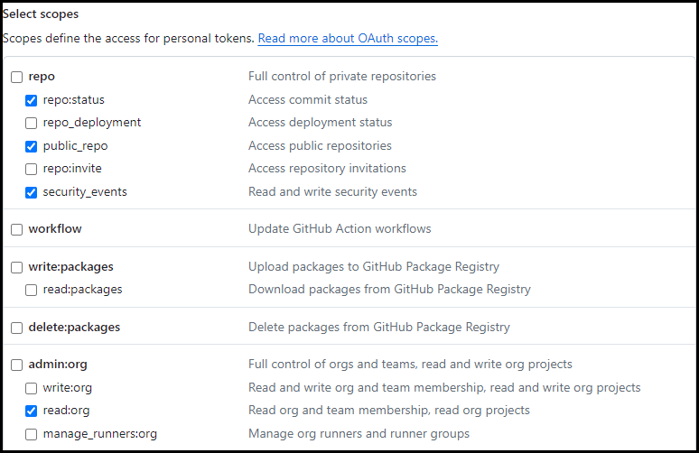

# GraphQL-Query-Web-Viewer
## A PoC Python Web application using Flask to view a GraphQL API query .json output as chart using the Plotly Python library.

### This code uses the ```.env``` file to store the bearer token, remember to create this file and add it to your local ```.gitgnore``` to avoid exponsing the secret. The query in this app was previously generated to extract Dependabot alerts, feel free to experiment with other queries.

### For the bearer token, you will need the following scopes:
- **repo** repo:status, public_repo, security_events
- **admin:org** read:org



## Application SETUP

1. Install Flask, Plotly, Requests and Dotenv libraries: ``` pip install flask requests plotly python_dotenv ```
2. Set the Flask environment (FLASK_APP): ``` set FLASK_APP=app ```
3. Start Flask with ``` flask run ```
You will see the app running at (http://localhost:5000)
